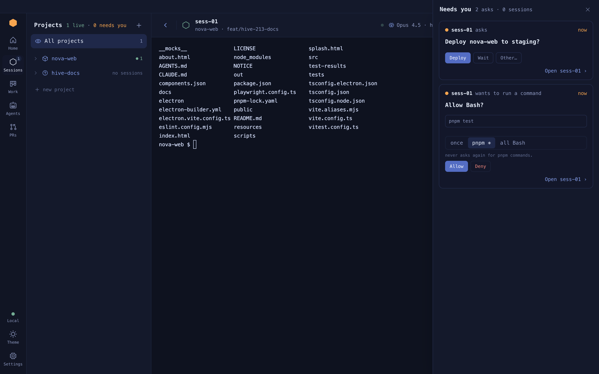

# The inbox

The inbox is the right rail's first tab. A card lands there when a session or agent needs
you, so you never have to watch every tab.

**On this page:** [How a notification is born](#how-a-notification-is-born) ·
[Card types](#card-types) · [Choosing what reaches you](#choosing-what-reaches-you) ·
[What clears a card](#what-clears-a-card)



## How a notification is born

The Hive writes a small hooks file for every session it starts. Claude Code then reports
what it is doing to a receiver inside the app, over loopback, with a per-session token.

<picture>
  <source media="(prefers-color-scheme: dark)" srcset="../assets/diagrams/inbox.dark.svg">
  
</picture>

| What Claude did | Kind raised |
| --- | --- |
| asked for permission, or asked a question | session blocked on you |
| finished its turn with nothing left running | session became yours again |
| sat idle waiting for input for a while | session ran out of instructions |
| an agent or session asked the overmind something | an agent asks you |

## Card types

- **Session cards.** Click to open the session. The card goes away on its own once the
  session stops waiting.
- **Question cards.** An agent or session asked something, with options. Click an option,
  or choose **Other…** and type your own answer when none of them fits. A question with
  no options shows the **Your answer** box straight away. Either way the answer goes back
  through the [ledger](ledger.md) and wakes the asker. Telling an agent to stop is an
  answer too: it closes its job as incomplete, tells whoever gave it the job, and
  releases what it was holding.
- **Permission cards.** An agent wants a tool outside its fence. The card shows the real
  call, like `pnpm test`, and a scope ladder: **once**, a command family like `pnpm *`, or
  **all Bash**. Anything wider than once is written into the agent's definition.
- **Redirected questions.** A question an agent asked a session that has since closed
  comes to you instead, captioned with the session it was meant for. Answer it here; the
  agent wakes as if that session had answered.
- **Goal cards.** A session running `/goal-on` reports its goal: active, a turn refused
  until the evidence exists, done or failed. One card per goal, updated in place; it
  reads itself once the goal settles.
- **Update, clone and PR cards.** A new version, a finished clone, a PR approved, merged or
  failing checks.

**Example.** An agent asks before it deploys:

```text
Deploy to production?          [ Approve ]  [ Reject ]
```

Clicking **Approve** posts an answer to that ask. The agent wakes, reads it, and carries on.

## Choosing what reaches you

**Settings › Notifications** has one row per kind. Each is **Off**, **Inbox**, or **Both**
(inbox plus a desktop notification).


Or in the config file:

```json
"notifications": {
  "session.blocked": "both",
  "session.idle": "inbox",
  "session.input_needed": "off"
}
```

## What clears a card

- Opening the session or agent it is about.
- The session leaving "needs input": you approved, answered, or typed a refusal.
  Pressing Escape on a prompt sends no hook, so that card stays until the next prompt.
- **Clear all** at the top of the tab. It leaves open questions and blocked sessions: they go when they are answered.

The inbox keeps the latest 50 cards of news, and every card still waiting on you however
many there are. It does not survive a restart. The dock icon counts what waits on you:
open questions, permission requests and blocked sessions, not unread cards.

## Round two: the pill and the drawer

Round two has no Inbox tab. The Inbox comes to you instead, in the stage's
bottom-right corner, just above the page's own input. Classic is unchanged.

- **The pill** counts what needs you: open questions, permission requests,
  review requests and blocked sessions, leaving out the session on stage. It is
  absent at zero, and reads **99+** past ninety-nine; a screen reader still
  hears the exact number.
- **Cards.** A new ask rises above the pill as an answerable card. It stays 5
  seconds, then folds into the pill. Pointing at it, focusing in it, or
  answering it holds it up; ✕ folds it at once. Several at once stack, the
  newest on top, under "N arrived just now · newest first". Each arrival
  restarts the 5 seconds. A card never takes the keyboard.
- **Notes.** A session off stage that asks a question rises as a note:
  **Open the session** takes you there, **Later** folds it.
- **The quiet rules.** With the keyboard in a terminal, nothing rises; the
  pill pulses once instead. With Settings open, arrivals wait and rise when it
  closes. The session on stage never shows.
- **The drawer.** The pill opens a 400px panel on the right, "Needs you", with
  every ask whole and the sessions off stage under it. Esc or ✕ closes it.
  Clicking an ask's desktop notification opens the drawer on that ask, and so
  does the header's bell.
- **Yours again.** A session in the Sessions panel that finished and is
  waiting for you reads "yours again" until you open it.

Echoes (news cards) are not in the Inbox in round two: they show on Home,
under **While you were away**, once nothing needs you. On Home, a **Needs you**
row opens the drawer on that ask.

