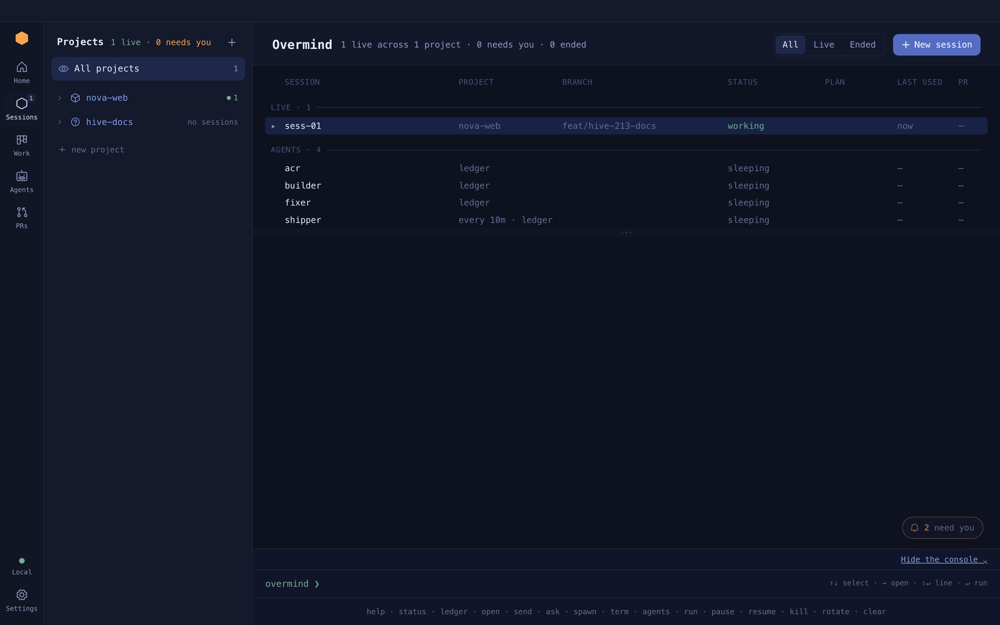

# The overmind console

The **overmind** is the Sessions place's page: a fleet table of every session and agent, a
transcript, and a command line. Press `⌘[` (or `←` at an empty Claude prompt) from any session to come
back here.

**On this page:** [The fleet table](#the-fleet-table) · [Commands](#commands) ·
[Examples](#examples) · [Errors you may see](#errors-you-may-see)



## The fleet table

Columns: **SESSION · PROJECT · BRANCH · STATUS · PLAN · LAST USED · PR**, then a resume
button on rows that can be resumed. **PLAN** is the session's task progress, a bar and
`done/total`; it is empty on agent rows and on sessions without a plan.

The rows come in three groups, each under a head with its count:

- **LIVE · N**, plus **· N NEEDS YOU** when sessions are waiting on you.
- **AGENTS · N**, plus **· N ASKING** when agents have a question open.
- **ENDED · N**, plus **· TODAY N**. Only today's endings are drawn; the rest wait behind
  **N more ›**, which shows them all.

Drag the handle under the table to give the transcript more room.

### The page head and filters

A head sits above the table:

- **Overmind**, then a line counting the fleet: `N live across M projects · N needs you ·
  N ended`.
- **All · Live · Ended** narrows the table. **Live** hides the ENDED group; **Ended** shows
  only ended sessions, all of them.
- **+ New session** opens the picker.

Click a project in the Sessions panel to filter the table to it. The head then reads
**Overmind › <project>** (click **Overmind** to widen it again), counts that project's
sessions, and names the agents working there. **+ New session in <project>** starts one
there directly. Filtered, ENDED shows every ending for the project, not just today's.

An agent is **working here** while it has a live run on a repository whose name is the
project folder's name (`repo:acme/nova-web` works in a project at `…/nova-web`). A
checkout whose folder is named differently from its repository never matches.

`↑` `↓` walk only the rows on screen, in the order the table draws them.

### The console dock

The transcript starts folded, and the table takes the page. The prompt stays
at the foot, with one line above it:

- Folded, the line shows the console's last line, and **Show the console ⌃** opens the
  transcript between the table and the prompt. The drag handle comes back with it.
- Shown, **Hide the console ⌄** folds it again.

Folding hides the transcript; it does not close it. Its scrollback is still there when you
open it again.

| Key | Does |
| --- | --- |
| `↑` `↓` | move the selection |
| `→` or `Enter` on an empty input | open the selected row |
| `Enter` | run the command |
| `Shift+Enter` | new line |

## Commands

`help` prints a shorter version of this list.

| Command | Does |
| --- | --- |
| `status` | one line per session |
| `open <session>` | put a session on the centre stage |
| `send <session> <message>` | type a message into a session and press Enter for you |
| `spawn <project> <task>` | start a new session on a project |
| `term [<project>\|<agent>]` | open a terminal in a project, on an agent's current worktree, or beside the selected session |
| `ledger [--open] [--events] [--from p] [--to p] [-n 20]` | print the tail of the [ledger](ledger.md) |
| `ask <agent> <message>` | ask an agent a question |
| `agents` | one line per agent |
| `run <agent> [prompt]` | wake an agent now, optionally saying why |
| `pause <agent>` / `resume <agent>` | stop or allow an agent's wakes |
| `kill <agent>` | stop the run in progress |
| `rotate <agent>` | have the agent hand off, then start a fresh session |
| `clear` | empty the transcript |

`<project>` is a key, an id or a name: `hive`, `the-hive` or `"The Hive"`. A name with
spaces needs quotes. `<session>` is an id or a name, in any case.

## Examples

```text
overmind ❯ spawn hive fix the flaky login test
overmind ❯ spawn "The Hive" add a dark-mode toggle to settings
overmind ❯ send ABC-123 run the e2e suite again
routed → ABC-123
overmind ❯ open ABC-123
opened ABC-123
overmind ❯ ask pr-patrol is PR 1234 safe to merge?
asked pr-patrol (a12)
overmind ❯ run pr-patrol review PR 1234
overmind ❯ ledger --open -n 10
```

## Errors you may see

| Line | Meaning |
| --- | --- |
| `usage: spawn <project> <task>` | a part of the command is missing |
| `unknown project: X` | no project has that key, id or name |
| `no such session: X` | no session has that id or name |
| `agents are asked, not sent: try ask …` | `send` is for sessions, `ask` is for agents |
| `terminals are typed into, not sent: open <id>` | open the terminal and type |
| `command not found: X — try help` | a typo |

The agent and ledger commands need the desktop app. The browser preview says so.
