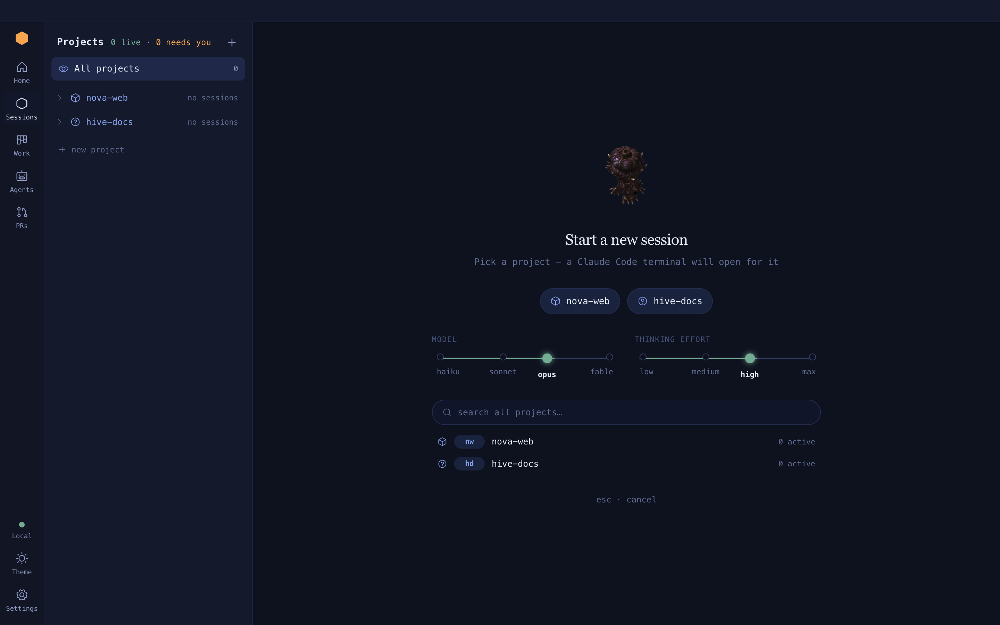

# Sessions and terminals

A **session** is a real `claude` running in a real terminal inside one of your projects.
A **terminal** is the same thing without Claude: a plain login shell.

**On this page:** [Start a session](#start-a-session) · [Talk to it](#talk-to-it) ·
[Status](#status) · [Names and branches](#names-and-branches) ·
[Finish with /done](#finish-with-done) · [Resume](#resume) ·
[Session history](#session-history) · [Terminals](#terminals)

## Start a session

Four ways, same result:

| From | Do this |
| --- | --- |
| The Overmind | **New session**, type a project, **Enter** (filtered to a project: **New session in** it, straight away) |
| The Sessions panel | **+** on the project's line, shown on hover (uses the picker's last model and effort) |
| A Jira ticket | **New session** under the ticket page's Actions; the session is named for the ticket |
| The console | `spawn <project> <task>` |



Models are `haiku`, `sonnet`, `opus` and `fable`. Effort is `low`, `medium`, `high` or
`max`. They become `--model` and `--effort` on the `claude` command line. Up to 24
sessions can run at once.

## Talk to it

There is no separate message box. Keys go straight to Claude Code's prompt, and the
terminal takes focus when it appears. While the shell boots, a cover hides the startup
noise until Claude is ready.

To type into a session without opening it, use the console:

```text
overmind ❯ send sess-03 run the tests again
routed → sess-03
```

## Status

Every session shows a coloured dot and a word.

| Label | Means | Your move |
| --- | --- | --- |
| **working** | a turn is in progress | wait |
| **needs input** | blocked on a permission prompt or a question | answer it; an inbox card is waiting |
| **idle** | the turn is over and nothing is running | your turn |
| **working (agents)** | Claude finished but a subagent is still running | wait |
| **working (scripts)** | a background shell is still running | wait, or carry on |
| **done** | ended on purpose (`/done`, `/clear`, or the app closed) | resume it if you want |
| **terminated** | the process is gone (`/exit`, `Ctrl+D`, a crash) | read the scrollback |

<picture>
  <source media="(prefers-color-scheme: dark)" srcset="../assets/diagrams/session-status.dark.svg">
  
</picture>

Status comes from Claude Code's own hooks, so "needs input" is exact rather than guessed.

## Names and branches

- Every session gets an id like `sess-07` that never changes.
- Claude titles the session from its conversation. The Hive tidies that into a short
  hyphenated name, at most four words.
- A ticket key always leads the name. Typing `work on ABC-123` links the session to
  that Jira issue once Jira confirms it exists:
  `back key interception abc-123` becomes `ABC-123-back-key-interception`.
- The console and the lists accept either the id or the name, in any case.
- The branch is whatever git reports in the session's folder. A dash means none has been
  seen yet.

## Finish with /done

Type `/done` in a session. The Hive marks it done and closes its terminal when the turn
ends. The row stays under **ENDED** and is still readable.

`/done` is a skill The Hive adds to every session it starts. Your own skills can end with
it too ([Custom skills](skills.md)). If the app cannot be reached, the skill tells you to
type `/exit` instead.

## Resume

Rows ended by `/done` or by quitting the app show a **resume** button in the fleet table.
It restarts `claude --resume` on the same conversation and moves the row back up. A row
ended by `/clear` cannot be resumed: its terminal already carried on as a new session.

## Session history

The 20 most recent ended sessions survive a restart. They come back under ENDED, newest
first. The column **LAST USED** is when each one ended or last resumed.

## The Sessions place

The **Sessions** icon on the bar opens the Sessions panel beside the overmind.

- The head reads **Projects**, then how many sessions and terminals are live and how many
  need you. **+** adds a project.
- **All projects** shows the whole fleet in the overmind.
- Each project starts folded. Folded, a badge on its icon counts what is inside: amber for
  sessions waiting on you, else green for everything live. With nothing live it shows
  nothing.
- Click a project's **name** to filter the overmind to it; that also unfolds it. The
  caret beside it only folds and unfolds.
- Unfolded, each session is one line under a comb — filled while it works, hollow when
  idle — then the project's terminals.
- Hover a project's line for **+** (new session) and **>_** (terminal); the counts give
  way to them.
- Opening a session unfolds its project. Coming back with the back button, `⌘[` or the
  Sessions icon keeps the filter you left and puts the selection on the session you were
  in.
- Leave Sessions for another place and the Sessions icon brings you back to the session
  you had open, or to the overmind if you had none or it has since ended.
- The session header over the terminal carries the model and its usage gauges; a plain
  terminal's has none.

### The session header

The session header sits over a session's terminal:

- **‹ Overmind** goes back to the overmind, as `⌘[` does, with the selection on this
  session.
- The session's name, with its task as the tooltip, over `project · branch`.
- Its status, then a space reserved for the model.
- **⋯** holds **Terminal here** and, when the session has one, **Open PR #N**.

A terminal gets the same header: its name over `project · folder`, and its state. It has
no model and no menu.

### When a session ends

A session that ends while you are looking at it (`/exit`, `/done`, or its process going)
takes you back to the overmind, with the selection on its row. `/clear` does not, because its
terminal carries on as a new session.

An ended session's row can't be opened; **Resume** on the row picks it back up when it can.
If a session ends while you are in its editor, its header's status reads **Ended**, with the
reason as its tooltip, and a card covers the terminal when you come back to it: **This session ended**, why, and how long ago. When the conversation can be picked
up it adds that its transcript is on disk, and **Resume**. **‹ Overmind** is always there.
✕ closes the card to a strip along the foot, with the reason, Resume and Overmind, so you
can read the scrollback above it. Closing is per session and forgotten on restart.

### A narrow window

Under 1,200px wide the list panel floats over the stage instead of sitting beside it, and
starts closed. The bar icon opens it; picking a row, clicking beside it or Esc closes it.

## Terminals

A terminal is a login shell in a project with no Claude in it: no hooks, no cost, no
history, no resume. Its status is **at prompt** or the name of the program running in it,
like `vitest` or `vim`.

| Open one from | How |
| --- | --- |
| The Sessions panel | **Terminal** under an unfolded project |
| A session | **Terminal here** in its session header's **⋯** menu, or ``Ctrl+` `` |
| The console | `term hive`, or `term` for beside the selected row |

A shell that exits normally disappears. One that dies shows why, with a **Close** button.
