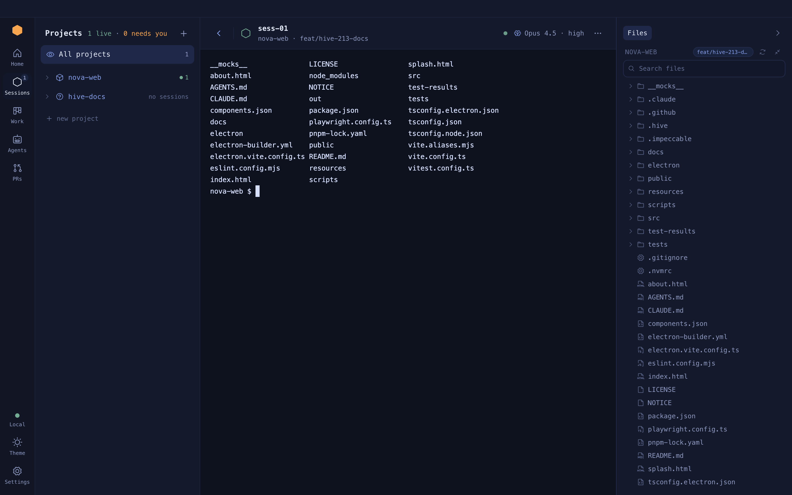
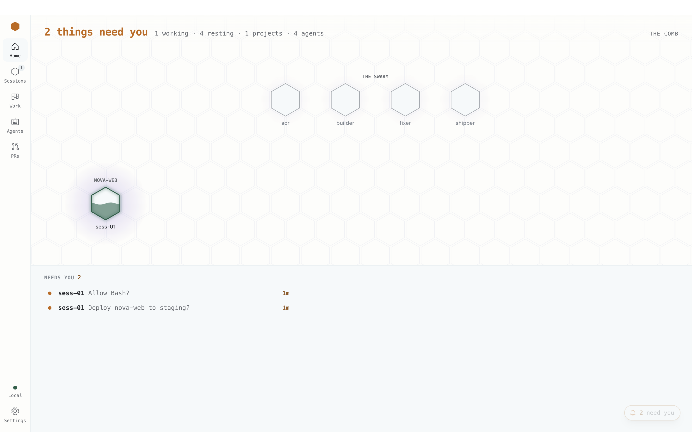

# A tour of the window

Left to right: the bar, a list panel, the stage, and the session panel. The stage shows
exactly one thing at a time.

**On this page:** [The layout](#the-layout) · [The bar](#the-bar) ·
[The list panel](#the-list-panel) · [The stage](#the-stage) ·
[The session panel](#the-session-panel) · [The pill and the drawer](#the-pill-and-the-drawer) ·
[Keyboard shortcuts](#keyboard-shortcuts)

## The layout

None of the panels is dragged to a size. The list panel opens and closes with `⌘B`, the session
panel with `⌘⌥B`. In a window narrower than 1,200px the list panel opens over the stage instead of
beside it, and the session panel stays closed to its strip. The terminal never gets squeezed out.

## The bar

The bar runs down the left edge.

| Part | What it does |
| --- | --- |
| App icon at the top | Hive TTY. Your team name is at the right of Home's headline |
| **Home** | Everything at a glance. See [The stage](#the-stage) |
| **Sessions** | Your projects and their sessions, and the Overmind |
| **Work** | Your Jira tickets. See [Jira and pull requests](work-and-prs.md) |
| **Agents** | Background agents. See [Agents](agents.md) |
| **PRs** | Your pull requests. See [Jira and pull requests](work-and-prs.md) |
| Connection item | Where this Hive runs. See below |
| Sun / moon | Switch between the theme's light and dark mode. From System, it picks the opposite of what is showing |
| Gear | Open Settings |

Counts sit on the icons. Sessions and Agents show how many are working, in grey. PRs shows how
many need you, in amber. A zero shows nothing.

Click a place to open it. Click the place you are already on to close or reopen its list panel.

The connection item reads **Local** with a green dot when this Hive runs only here. It turns to
**Serving** or the server's name (brand) when serving or attached, an amber ring and the server's
name while reconnecting, red once disconnected, and amber **Exposed** or **Demo**. Click it for
every state that holds and a link to the Settings pane that turns it off.

## The list panel

One panel, for the place you are on. Home has none.

| Place | The panel lists |
| --- | --- |
| **Sessions** | Each project, folded, with its sessions and terminals underneath. **All projects** on top shows the whole fleet on the Overmind; a project's name narrows it to that project. The **+** opens the new-session picker |
| **Work** | Your Jira tickets, grouped by status |
| **Agents** | Background agents in three lanes: Summons (asking or failed), Morphing (working), Burrowed (sleeping or paused) |
| **PRs** | The Hatchery: your open pull requests, with the merged ones folded underneath |

A place with nothing to list draws no panel, and the stage says why and how to add the first one.

## The stage

It shows one view, chosen in this order:

1. Settings, when open.
2. The new-session picker.
3. The place you are on, when it owns the stage: **Home**, a Work ticket, an agent page, or a PR
   page.
4. The editor, when a file is open full-stage.
5. The Overmind, when its tab is active or nothing is selected.
6. The selected session or terminal.

Hiding a terminal never closes it. Open Settings over a busy session and its scrollback is
still there when you come back.

**Home** is the comb: one hexagon for every live session, terminal and agent, under a headline
that counts what needs you. Under the comb, **Needs you** (or **While you were away** when nothing
does), **Coming up**, **Limits** and **Pull requests**. With no project yet, Home is the first-run
page: Add a project, connect your integrations, and New session.

**The Overmind** is the Sessions place's page: its head with **New session**, the fleet table, and
the console at the foot. See [The overmind console](overmind-console.md).

**A session** is its terminal under the session header: **‹** back to the Overmind, the session's
status, task and branch, the model chip with its gauges (when you sign in with a Claude plan), and
the **⋯** menu with **Terminal here**, which opens a shell beside it in the same folder.

## The session panel

While a session or terminal is on the stage, the session panel sits at the right edge with one
tab for each thing the session has:

| Tab | Shows |
| --- | --- |
| **Plan** | The session's plan, task by task. See [The plan panel](plan-panel.md) |
| **Ticket** | The Jira ticket the session works on |
| **PR** | The session's pull request and its state |
| **Files** | The repository, with what this session changed on top. See [Files and the editor](explorer.md) |

A tab appears only when the session has that thing. Close the panel with **›** or `⌘⌥B` and it
becomes a strip of icons, each with one fact, such as `2 files changed`. Click one to open the
panel on that tab.

## The pill and the drawer

The pill sits in the stage's bottom-right corner and counts what needs you: asks from agents and
sessions waiting on you. Nothing waiting, no pill. A new arrival rises above it as a card; one that
arrives while you are typing in a terminal pulses the pill instead.

Click the pill to open the drawer, the whole queue down the window's right edge: every ask as a
card you can answer there, then the sessions waiting on you. See [The inbox](inbox.md).

## Keyboard shortcuts

| Action | macOS | Linux |
| --- | --- | --- |
| Back to the overmind | `⌘[` | `Ctrl+Shift+←` |
| Back to the overmind from an empty Claude prompt | `←` | `←` |
| Toggle the list panel | `⌘B` | `Ctrl+Shift+B` |
| Toggle the session panel | `⌘⌥B` | `Ctrl+Shift+Alt+B` |
| Terminal here, beside the current session | ``Ctrl+` `` | ``Ctrl+` `` |
| New line without sending | `Shift+Enter` | `Shift+Enter` |
| Copy / paste in a terminal | `⌘C` (with a selection) / `⌘V` | `Ctrl+Shift+C` / `Ctrl+Shift+V` |
| Interrupt | `Ctrl+C` | `Ctrl+C` with nothing selected |
| Save a file in the editor | `⌘S` | |

**Example.** You are in `ABC-123` and want to run the tests beside it without disturbing
Claude:

1. Press ``Ctrl+` ``. A terminal opens in the same folder, next to the session.
2. Run `pnpm test` there.
3. Press `⌘[` to go back to the overmind when you are done.

In the overmind console, `↑` and `↓` move through the fleet table and `Enter` on an empty
input opens the selected row. There is no shortcut for Settings yet.
